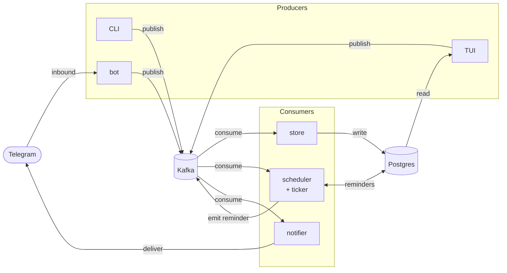

# Job Tracker

An event-sourced job-application tracker. Three frontends (shell CLI,
desktop TUI, Telegram bot) publish events to Kafka; three consumers
(store, scheduler, notifier) react. Postgres is the read model.

## Architecture



> Editable source: [`docs/job-tracker-architecture-dig.png`](docs/job-tracker-architecture-dig.png) (excalidraw export).

- **Producers** — `cli`, `jobtracker` (TUI), `bot` — publish through the
  shared `internal/jobclient` library so every frontend speaks the same
  event contracts.
- **Kafka** is the spine. Six topics carry every state change:
  `job.submitted`, `job.status.changed`, `job.note.added`,
  `job.interview.recorded`, `job.edited`, `job.reminder`.
- **Consumers** —
  - `store` subscribes to the five write topics and writes Postgres.
  - `scheduler` subscribes to submits + status changes, runs a ticker,
    and emits `job.reminder` when a job has been idle long enough.
  - `notifier` subscribes to `job.reminder` and delivers via Telegram.
- **Postgres** is the read model. The TUI reads it directly and gets
  push refresh via `LISTEN/NOTIFY` (ADR 0012); no API tier.

Deeper design rationale lives in [`docs/adr/`](docs/adr/).

## Stack

- **Kafka 4.2** in KRaft mode (no ZooKeeper)
- **Postgres 16**
- **Go 1.25** — one image, six binaries
- **Kafka UI** (provectus) for topic/consumer inspection on `:8088`

## Services

| Binary       | Role                     | Subscribes to                                                                                          | Publishes              |
|--------------|--------------------------|--------------------------------------------------------------------------------------------------------|------------------------|
| `cli`        | shell producer           | —                                                                                                      | all write topics       |
| `jobtracker` | desktop TUI (ADR 0004)   | — (reads Postgres directly; `LISTEN/NOTIFY` for refresh)                                               | all write topics       |
| `bot`        | Telegram bot (ADR 0003)  | — (long-polls Telegram)                                                                                | all write topics       |
| `store`      | persistence consumer     | `job.submitted`, `job.status.changed`, `job.note.added`, `job.interview.recorded`, `job.edited`        | —                      |
| `scheduler`  | reminder writer + ticker | `job.submitted`, `job.status.changed`                                                                  | `job.reminder`         |
| `notifier`   | Telegram delivery        | `job.reminder`                                                                                         | —                      |

The `store` and `scheduler` consumers each expose a small admin server
(`/skip-count`, `/healthz`) on `127.0.0.1:9090` and `:9091` respectively
(ADR 0006).

## Quick start

Prereqs: `podman` + `podman-compose` (or `docker` / `docker compose` —
override with `COMPOSE=docker`), Go 1.25, optionally
[`golang-migrate`](https://github.com/golang-migrate/migrate) on PATH.

```bash
cp .env.example .env                  # adjust if needed
make up                               # kafka + postgres + kafka-ui
make migrate-up                       # apply schema
go run ./cmd/cli ensure-topics        # one-time topic creation
```

Run the consumers in separate terminals (or via compose — see below):

```bash
go run ./cmd/store
go run ./cmd/scheduler
go run ./cmd/notifier
```

Then publish a job:

```bash
go run ./cmd/cli add \
  --url https://example.com/posting \
  --title "Staff Engineer" \
  --company Acme
# → prints the job_id; reuse it for follow-ups
go run ./cmd/cli status <job-id> applied
```

Open Kafka UI at <http://localhost:8088> to inspect topics and
consumer-group offsets.

## Running on a server

Everything ships as one image; `compose.yml` defines six services
sharing it. To run the full stack in containers:

```bash
make up                # brings up infra + consumers
make ps                # check health
```

To roll a new build in place:

```bash
make deploy            # pull → build → migrate → recreate app services
```

`deploy` leaves Kafka and Postgres untouched (no data-plane bounce) and
assumes additive migrations; destructive ones go by hand. Full
walkthrough in [`docs/runbook.md`](docs/runbook.md).

## Configuration

All config is env-driven via `internal/config` (ADR 0008). See
[`.env.example`](.env.example) for the full list; the essentials:

| Variable                                        | Purpose                                                        |
|-------------------------------------------------|----------------------------------------------------------------|
| `KAFKA_BOOTSTRAP`                               | broker list (`localhost:9092` on host, `kafka:29092` in net)   |
| `DATABASE_URL`                                  | Postgres DSN                                                   |
| `TELEGRAM_BOT_TOKEN`, `TELEGRAM_CHAT_ID`        | notifier + bot credentials (notifier degrades to stdout if unset) |
| `REMINDER_HOUR`, `REMINDER_TZ`                  | snap reminders forward to a local hour-of-day                  |
| `REMINDER_SAVED_SECONDS`, `REMINDER_POLL_SECONDS` | smoke-test overrides — fire reminders in seconds, not days   |
| `JOB_TRACKER_*`                                 | desktop TUI overrides (separate namespace, lives in shell rc)  |

For a fast end-to-end reminder smoke test:

```bash
REMINDER_SAVED_SECONDS=10 REMINDER_POLL_SECONDS=2 go run ./cmd/scheduler
```

## Schema migrations

Migrations live in `internal/db/migrations/` as timestamped
`*.up.sql` / `*.down.sql` pairs, applied by `golang-migrate` (ADR 0009).
Services do **not** apply schema on startup — booting against an
un-migrated DB fails at the first query, which is your signal to run
`make migrate-up`.

```bash
make migrate-new NAME=add_jobs_owner   # writes the pair
$EDITOR internal/db/migrations/<ts>_add_jobs_owner.{up,down}.sql
make migrate-up
```

`make help` lists every migration target (`migrate-version`,
`migrate-force`, `migrate-down-one`, …).

## Development

```bash
make build             # go build ./...
make test              # go test ./...
make fmt vet tidy
```

## See also

- [`docs/runbook.md`](docs/runbook.md) — fresh-machine bootstrap and
  operator playbook.
- [`docs/adr/`](docs/adr/) — design decisions, including the schema
  redesign (0001), shared client lib (0002), Telegram bot (0003),
  desktop TUI (0004), producer validation (0005), consumer error
  classification (0006), notifier dedup (0007), shared config (0008),
  migrations (0009), companies as first-class (0010), partial edits
  (0011), push-based TUI reconciliation (0012), status transitions
  (0013).
- [`compose.yml`](compose.yml) — broker listeners, healthchecks, admin
  port bindings.
